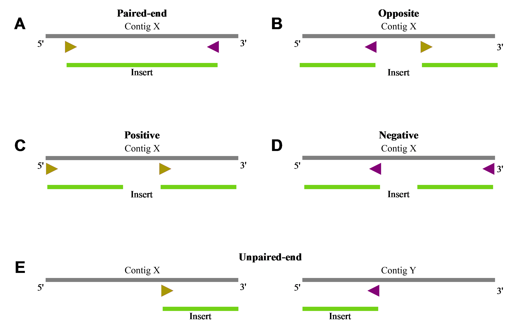
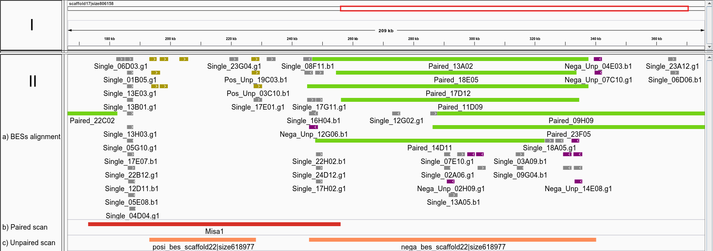
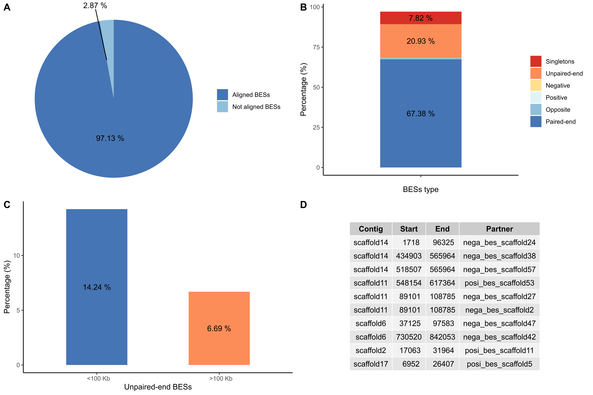

# BES analysis, alignment with a reference and classification

Created: October 10th, 2019

Updated: February 19th, 2021

Authors: C. Gómez-Muñoz*, L.F. García-Ortega, J.I. Montalvo-Arredondo.

*cintia.gomez@ipicyt.edu.mx

For quick help:

```bash
./bes_analysis.sh -h
```

---

## 1. Introduction

BAC-end sequences (BESs) are paired-end sequences originated from Bacterial Artificial Chromosomes (BACs) and that are separated by a fixed distance. BESs can be aligned to a reference genome and classified according to the orientation between the pairs (Figure 1).



**Figure 1.** BESs classification according to the alignment orientation between the pairs.

## 2. Prerequisites

The following pipeline runs in Linux based platforms. Additionally you should have installed and available in your `$PATH` the following programs:

* **seqret** EMBOSS:6.6.0.0
* **fastqc** 0.11.5
* **TrimmomaticSE** 0.36
* **fastq_to_fasta** 0.0.14
* **blastn** 2.6.0+
* **megablast** 2.6.0+
* **blat** 36x2
* **nucmer** 3.1
* **bowtie** 1.2.2
* **bowtie2** 2.3.4.1
* **BWA** 0.7.17
* **Python** version 3.7.0
* **R** version 3.6.1

The script checks anyway if you have them installed and give generic instructions to install them. The pipeline can be ran without some alignment programs, only if they are not called in.

## 3. Main Pipeline

The script **bes_analysis.sh** calls in other programs but has the advantage that it automats the process. The script proceeds in five eligible stages:

1. '**abi2fastq**' finds all Sanger reads in **AB1** format of a directory and convert them into **FASTQ** format.
2. '**qual**' evaluates per base quality of the sequences a gives a report using FastQC.
3. '**trim**' trims and filters low quality BESs using Trimmomatic.
4. '**format**' formats the **FASTA** genome headers in order to be correctly read by the script.
5. '**align**' aligns them to a reference genome with one of the following methods:
  * BLAST
  * MEGA (megablast)
  * BLAT
  * NUC (nucmer)
  * BOW (bowtie)
  * BOW2 (bowtie2)
  * BWA

Some of these stages can be bypassed, depending on the input data. If input files are from a different sequencing technology that retrieves files in **FASTQ** format, the first stage (‘**abi2fastq**’) can be omitted and directly proceed to the following quality assessment (‘**qual**’) and trimming (‘**trim**’) stages. Similarly, if the **FASTQ** reads were already evaluated and trimmed, the second and third stages can be skipped and proceed to the aligning stage (‘**align**’). This stage converts **FASTQ** sequences to **FASTA** format prior the alignment. If the input sequences are already in **FASTA** format, these sequences can be also directly introduced at this stage. As consequence, **FASTQ** and **FASTA** formats, besides **AB1** format, could be used with the pipeline. Considering that this pipeline has been optimized to analyze files at most 4000 sequences, some adjustments might be needed if the files contain more sequences.

### 3.1. Convert AB1 files to FASTQ (abi2fastq)

BESs are obtained through Sanger sequencing, therefore, the initial BESs file are in **AB1** format stored in a single directory. To convert such files to **FASTQ** format, a more suitable format for downstream analyses, one can use the '**abi2fastq**' stage of the **bes_analysis.sh** script giving as input the sequence's directory.

```bash
./bes_analysis.sh -s abi2fastq -i INPUT.directory
```

The former converts the **AB1** files into **FASTQ** format. In order to preceed with the following analysis, all the **FASTQ** are concatenated by the script. If your sequences are already in **FASTQ** or **FASTA** format, concatenate then using `cat *.fastq > all_bes.fastq` in the command line.

### 3.2. Evaluate sequence quality (qual)

Next step is to analyze the sequences quality. For that, one can run **FASTQC** with a simple command.

```bash
./bes_analysis.sh -s qual -i INPUT.file
```

### 3.3. Trimming sequences (trim)

This step is perfomerd with Trimmomatic as follows.

```bash
./bes_analysis.sh -s trim -i INPUT.file
```

Trimmomatic parameters were optimized to generate the sequences LIBGSS_039348; however, additional input parameters can be modified ussing this aplicaction. These are: `-c HEADCROP`, `-p PHRED_CODING`, `-w WINDOW_SIZE`, `-l LENGTH`, and `-t THRESHOLD`.

After running this stage, you can run again the '**qual**' stage to verify the sequences quality.

### 3.4. Genome FASTA headers formatting (format)

The pipeline requieres that the contigs size information of the reference genome is included in the header for downstream analysis. Therefore, before running the following stages, make sure that your genome **FASTA** headers have this format: `>sequence1|size1234`. We recommend formatting your **FASTA** headers with:

```bash
Rscript format_genome.R genome.fasta out_name.fasta
```

The former script requieres R version 3.6.1 and [Biostrings](https://bioconductor.org/packages/release/bioc/html/Biostrings.html).

Alternatively, you can format your reference genome **FASTA** headers with the following command:

```bash
./bes_analysis.sh -s format -i none -g GENOME.fasta
```

The input `-i none` is required to perform the argument parsing correctly.

### 3.5. BESs alignmet with a reference genome (align)

This stage is the main function of the script. The objective is to locate the sequences in a reference genome. This can be done using:

```bash
./bes_analysis.sh -s align -i INPUT.file -g GENOME.fasta -m METHOD
```

The script has the ability to align the BESs sequences (or any other sequences) using one of the available aligning programs. These are BLAST, MEGABLAST, BLAT, NUCMER, BOWTIE, BOWTIE2, and BWA. For that, you only need to subsititue method in the `-m` argument for 'BLAST', 'MEGA', 'BLAT', 'NUC', 'BOW', 'BOW2', or 'BWA', respectively. For example:

```bash
./bes_analysis.sh -s align -i INPUT.file -g GENOME.fasta -m BLAST
```

An additional optional argument for this stage is `-e` or E-value for BLAST and MEGABLAST. Defatul E-value is 0.000001.

After the alignmet, the output of the methods that retrieves more than one alignment per sequence goes trough a filtering process in which the longest or primary alignment is selected. In case of a tie, the firts alignment is selected. Then, the script converts any alignment output into **GFF3** format for easier visualization in the Integrative Genomics Viewer (IGV). Therefore, this script is also useful to align any other sequences and visualize them in the IGV. The script performs by default a screening calling in a Python script included in this repository (**screening.py**). This script classifies the BESs pairs according to their orientation in single-end, paired-end, unpaired-end, opposite, positive and negative. For the screening process to work, sequences form the same plasmid (paired-end sequences) must be next to each other in the initial file (for example, sequence_from_plasmid1.fw must be followed by sequence_from_plasmid1.rv, and so on). This screening option can be disabled by using the optional argument `-q no` (default is 'yes').

The results stored are stored in a output directory called 'BES_out' (you can specify your own directory with the input argument `-o OUTPUT_DIR`). This directory consists of the alingmet method default output, an initial GFF3 file, a final formatted **GFF3**, and a summary table in a plain text file. The final formatted **GFF3** file can aid in visual inpsection in a genome browser, for example the IGV (Figure 2).



**Figure 2.** Example vizualization of the formatted GFF3 file. The region of interest (top panel, I) was visualized in the IGV, along with the evidence information (bottom panel, II). a) Formatted GFF3 file of the BESs alignments. Paired-end alignments are shown with its simulated insert in green, unpaired-end BESs aligned positively and negatively are presented in yellow and purple, respectively; single alignmnets are shown in gray. Positive, negative and opposite alignments, although not shown in the image, are assigned the colors pink, cyan and red, respectively. b) Paired-end BESs scanning results (red line). c) Unpaired-end scanning results (orange lines).

## 4. Extra analyses
Regions not sustained by paired-end alignment are and indication of a misassembly, or strain specific differences; while region enriched with unpaired-end alignment suggest possible contig joins. Visual inpsection can be time consuming; therefore, two additional scripts that help to detect regions not spanned by paired-end alignments (**sliding_paired.py**) and regions enriched with unpaired-end alignments (**sliding_unpaired.py**) can be ran over the final formatted **GFF3** file. These scripts work using an sliding window algorithm and Pandas dataframes.

```
./sliding_paired.py formatted_GFF_final.gff > lacking_paired_regions.bed
./sliding_unpaired.py formatted_GFF_final.gff > enriched_unpaired_regions.bed
```

The ouput of the former commands are **BED** files that can be loaded simultaneously with the formatted **GFF3** file to aid with visual inspection (Figure 2, panel IIb and IIc).

Finally, you can also run a R script to generate a graphic summary of the results (**graphic_summary.R**) from the BESs alignment summary, the number of input BESs, the enriched_unpaired_regions.bed file, and the output image name (Figure 3). For example:

```bash
Rscript graphic_summary.R bes_vs_genome_method.summary 4004 enriched_unpaired_regions.bed graphic_summary.tiff
```



**Figure 3.** Graphic example summary. A) Percentage of aligned BESs. B) percentage of the different BESs types. C) percentage of unpaired-end BES according to the insert size. Negative, positive and opposite BESs bars are not observed because they are less than 1%. D) Regions with consistent unpaired-end BESs aligned (only the first ten are shown).

Edit your **BED** file `enriched_unpaired_regions.bed` with `sed` in the reference sequences are too long to be properly diplayed in the graphic summary.
